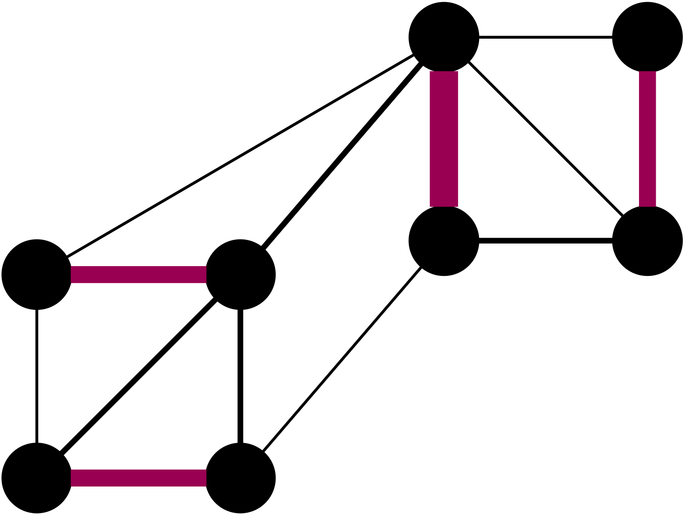

# Dynamic Matching in Practice 
[](https://app.codacy.com/gh/DynGraphLab/DynMatch?utm_source=github.com&utm_medium=referral&utm_content=DynGraphLab/DynMatch&utm_campaign=Badge_Grade_Dashboard)
[](https://opensource.org/licenses/MIT)
[](https://app.fossa.com/projects/git%2Bgithub.com%2FDynGraphLab%2FDynMatch?ref=badge_shield)
<p align="center">

</p>


## Downloading DynMatch: 
You can download DynMatch with the following command line:

```console
git clone https://github.com/DynGraphLab/DynMatch
```

## Compiling DynMatch: 
To compile the codes, just type 
```console
./compile_withcmake.sh. 
```
In this case, all binaries, libraries and headers are in the folder ./deploy/ 

Alternatively use the standard cmake build process:
```console 
mkdir build
cd build 
cmake ../ -DCMAKE_BUILD_TYPE=Release     
make 
cd ..
```

## Usage DynMatch ##
`dynmatch FILE [options]`.    

### Options ###
This is a brief overview of the most important options.

`FILE`
Path to graph file that you maintain a dynamic matching for.

`-help`
Print help.

`-seed=<int>`
Seed to use for the random number generator.

`--algorithm=TYPE`
One of {staticblossom, dynblossom, randomwalk, neimansolomon, baswanaguptasen}

`-eps=<double>`
Epsilon. Limit search depth of random walk or augmenting path search in dynblossom to 2/eps-1.

`--dynblossom_lazy`
Only start augmenting path searchs after x newly inserted edges on an endpoint.

`--dynblossom_maintain_opt`
Maintain optimum in dynblossom. (Without this option the algorithm is called UNSAFE)

`-measure_graph_only` 
 Only measure graph construction time.


## File Format ##
The main folder contains example dynamic sequences in the example folder.
Here are the first couple of lines of munmun_digg.undo.0.1.seq. The first number after the # is the number of nodes that the graph has (at most) and the next number is the number of updates that are performed. Then in each line is one operation. The first number is 1 if an edge is inserted and 0 if an edge is deleted. The two numbers after that are the corresponding end points of the respective edge.
```code
# 30399 87627
1 1 2
1 51 52
1 91 92
1 124 125
1 34 35
1 152 153
```
Licence
=====
The program is licenced under MIT licence.
If you publish results using our algorithms, please acknowledge our work by quoting the following paper:


```
@inproceedings{DBLP:conf/esa/Henzinger0P020,
  author    = {Monika Henzinger and
               Shahbaz Khan and
               Richard Paul and
               Christian Schulz},
  title     = {Dynamic Matching Algorithms in Practice},
  booktitle = {28th Annual European Symposium on Algorithms, {ESA} 2020, September
               7-9, 2020, Pisa, Italy (Virtual Conference)},
  pages     = {58:1--58:20},
  year      = {2020},
  crossref  = {DBLP:conf/esa/2020},
  url       = {https://doi.org/10.4230/LIPIcs.ESA.2020.58},
  doi       = {10.4230/LIPIcs.ESA.2020.58},
  timestamp = {Wed, 26 Aug 2020 16:56:07 +0200},
  biburl    = {https://dblp.org/rec/conf/esa/Henzinger0P020.bib},
  bibsource = {dblp computer science bibliography, https://dblp.org}
}

@proceedings{DBLP:conf/esa/2020,
  editor    = {Fabrizio Grandoni and
               Grzegorz Herman and
               Peter Sanders},
  title     = {28th Annual European Symposium on Algorithms, {ESA} 2020, September
               7-9, 2020, Pisa, Italy (Virtual Conference)},
  series    = {LIPIcs},
  volume    = {173},
  publisher = {Schloss Dagstuhl - Leibniz-Zentrum f{\"{u}}r Informatik},
  year      = {2020},
  isbn      = {978-3-95977-162-7},
  timestamp = {Wed, 26 Aug 2020 16:29:43 +0200},
  biburl    = {https://dblp.org/rec/conf/esa/2020.bib},
  bibsource = {dblp computer science bibliography, https://dblp.org}
}
```

[](https://app.fossa.com/projects/git%2Bgithub.com%2FDynGraphLab%2FDynMatch?ref=badge_large)
